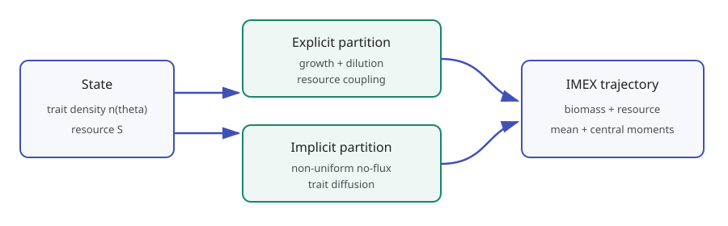
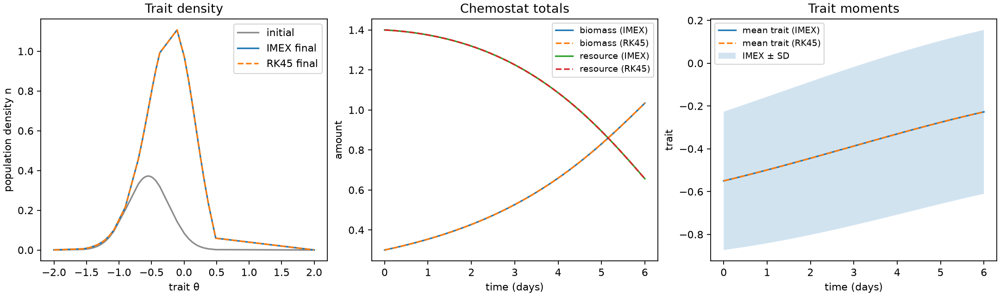

# Trait-structured chemostat PDE

The
[`chemostat_pde.py`](https://github.com/ACCIDDA/op_engine/blob/main/examples/chemostat_pde.py)
example couples a population density over a continuous trait coordinate to one
well-mixed resource. It demonstrates non-uniform finite-volume geometry,
implicit diffusion, nonlinear explicit coupling, and structured observables in
one reproducible comparison.



## Model and split

For population density `n(theta, t)` and resource `S(t)`, the example solves

```text
dn/dt = n g(theta, S) - D n + d d2n/dtheta2
dS/dt = D (S_in - S) - integral[n g(theta, S) w(theta) dtheta].
```

Growth combines Monod resource limitation with a Gaussian trait optimum. The
positive uptake weight varies exponentially with trait and is scaled by the
yield coefficient.

The split supplied to `CoreSolver` is:

| Partition | Terms |
| --- | --- |
| implicit linear | no-flux trait diffusion |
| explicit nonlinear | growth, dilution, resource inflow, and consumption |

`imex-heun-tr` treats the two partitions to second order. The implicit stage is
assembled additively as `L y = R y_n + explicit_increment`; the right
trapezoidal operator does not multiply the explicit increment.

The example does not clip stage states or project the result onto the positive
orthant. Positivity in the canonical run is an observed numerical diagnostic,
not an extra model operation.

## Non-uniform finite volumes

`build_trait_grid()` calls `generate_adaptive_grid()` on the curvature of the
initial Gaussian trait profile. More centers are placed where the initial
profile bends rapidly, while the domain endpoints remain fixed.

For adjacent center spacings `h_i`, the integration weights are

```text
q_0     = h_0
q_i     = (h_(i-1) + h_i) / 2
q_(N-1) = h_(N-2).
```

These are the same control-volume widths used by the non-uniform diffusion
operator. With reflecting boundaries, `q^T A = 0`, so diffusion alone
conserves total biomass.

## Structured observables

At every output time the example records resource and five summaries of the
trait distribution:

| Observable | Discrete definition |
| --- | --- |
| biomass | `I = sum_i q_i n_i` |
| mean trait | `rho = sum_i q_i n_i theta_i / I` |
| variance | `Sigma = sum_i q_i n_i (theta_i-rho)^2 / I` |
| skewness | third central moment divided by `Sigma^(3/2)` |
| kurtosis | fourth central moment divided by `Sigma^2` |

Kurtosis is the raw standardized fourth moment, not excess kurtosis.

## Run and interpret the comparison

From a development checkout:

```bash
uv sync --dev
uv run python examples/chemostat_pde.py
```

The command writes
`examples/output/chemostat_pde/chemostat_summary.png` and reports maximum state
and biomass differences. The committed reference figure below uses the default
41-cell grid and 0.02-day time step.



The panels compare initial and final trait densities, resource and total
biomass, and the evolving mean trait with one standard deviation. Dashed lines
come from SciPy RK45 applied to the same semi-discrete system with tight
tolerances. This comparison isolates time integration: RK45 uses the identical
grid, quadrature, reaction functions, diffusion matrix, and initial state.

The RK45 trajectory is a high-accuracy reference for this finite-dimensional
discretization, not an exact solution of the continuous PDE. Grid convergence
and time-step convergence remain separate checks.
